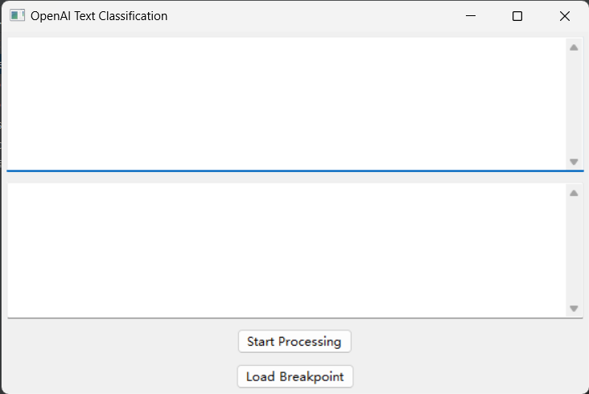
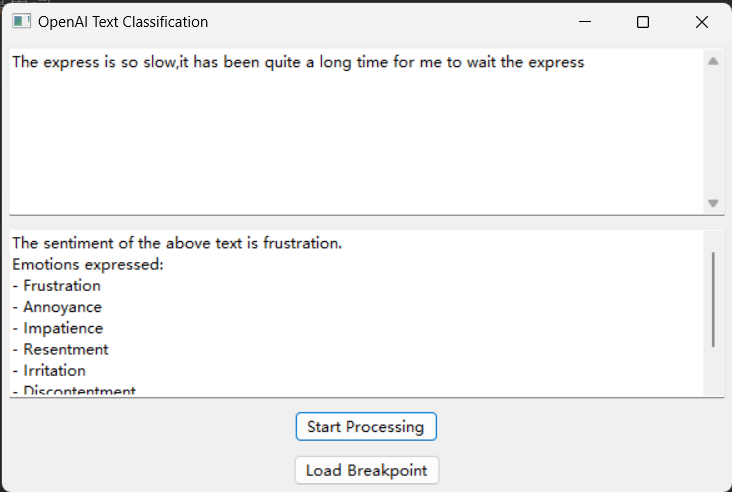
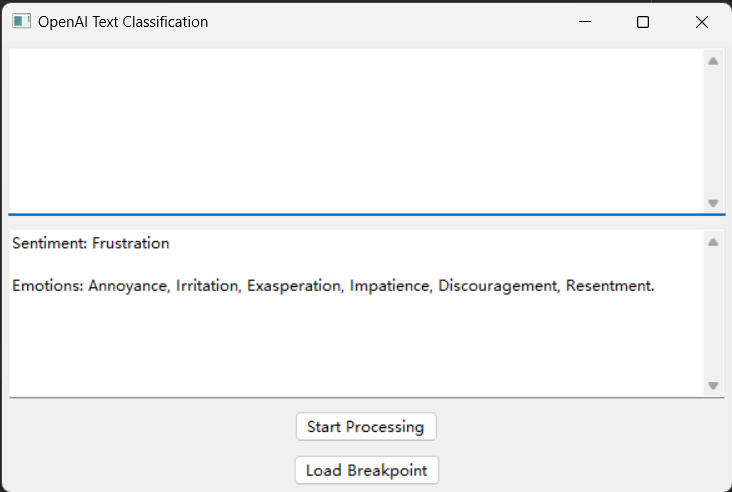
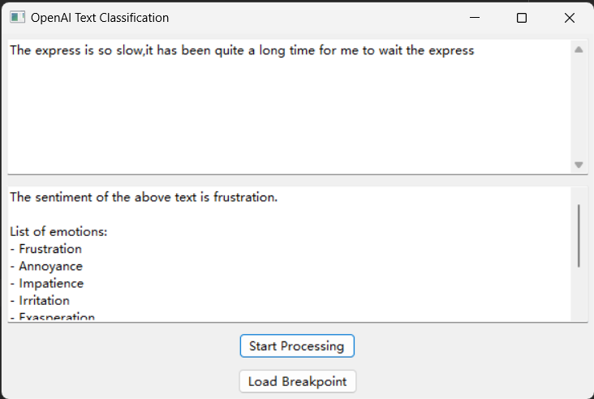
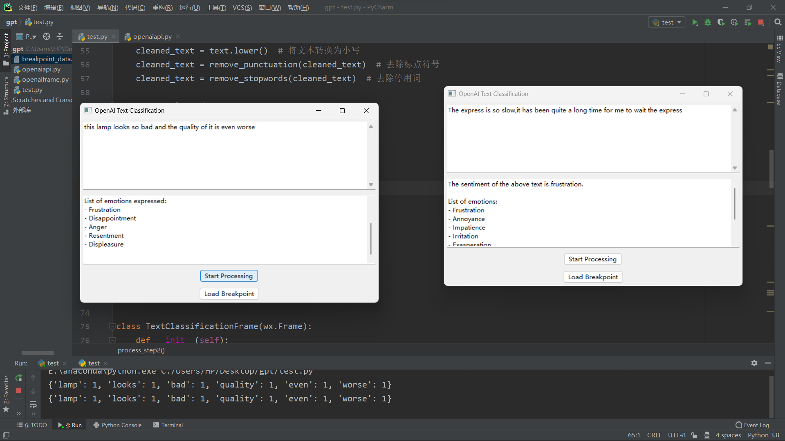

# OpenaiAPI调用实现文本分类问题的报告

## 实现功能

* 输入文本，返回API对文本的分类操作
* 在本地使用chain of thought，进行文本清洗、特征提取
* 调用API对文本进行分类
* 断点重爬
* 多线程


## 运行结果

### 启动画面



### 情感分析界面



### 断点重爬

清空当前输入界面



点击Load Breakpoint



### 多线程



## 使用技术

* 使用Python作为主要编程语言

### wxPython

使用wxPython用于构建GUI

### OpenAI API

用于进行实现情感分析等文本分类问题

### NLTK

Natural Language Toolkit，主要在实现chain of thought中使用

* 首先进行文本清洗，全部转化成小写字母、去除标点符号、去除停用词
* 然后进行特征提取

### Pickle

用于断点数据的序列化和反序列化

## 难点和解决方法

### 多步处理文本

通过定义多个函数，将处理逻辑模块化，按照顺序组合调用。

在实现中分别定义了不同文本处理函数，然后按照顺序依次进行处理一和处理二

```Python
def process_step1(text):
    # 文本清洗
    cleaned_text = text.lower()  # 将文本转换为小写
    cleaned_text = remove_punctuation(cleaned_text)  # 去除标点符号
    cleaned_text = remove_stopwords(cleaned_text)  # 去除停用词

    return cleaned_text


def process_step2(text):
    # 特征提取
    features = extract_features(text)  # 提取文本特征

    print(features)
    feature_text = ""
    while len(features) != 0:
        key = max(features)
        feature_text = feature_text + key + ' '
        del features[key]
    return feature_text
```

### 处理文本时文本清洗

大小写转换、去除标点符号和停用词

> 使用Python的`string`中的大小写转换
>
> ```Python
> cleaned_text = text.lower()  # 将文本转换为小写
> ```

> 使用Python的`string`模块中的`punctuation`字符串，利用`str.translate()`方法去除标点符号。
>
> ```Python
> def remove_punctuation(text):
>     # 去除标点符号
>     cleaned_text = text.translate(str.maketrans("", "", string.punctuation))
>     return cleaned_text
> ```

> 对于停用词，使用NLTK中的`stopwords`语料库，结合`word_tokenize()`方法对文本进行分词，然后通过列表推导式去除停用词。
>
> ```Python
> def remove_stopwords(text):
>     # 去除停用词
>     stop_words = set(stopwords.words("english"))
>     word_tokens = word_tokenize(text)
>     filtered_text = [word for word in word_tokens if word.lower() not in stop_words]
>     cleaned_text = " ".join(filtered_text)
>     return cleaned_text
> ```

### 断点重爬

在断点功能中，使用Pickle模块将断点数据保存为二进制文件，并在需要时加载和恢复数据，将加载按钮在图形化界面显示

### OpenAI API的调用

使用OpenAI官方提供的Python SDK，通过创建API对象并设置API密钥，调用相应的API方法实现文本分类

## 声明

由于需要在GitHub中设置public，API密钥并未在源代码给出，需要修改API密钥

